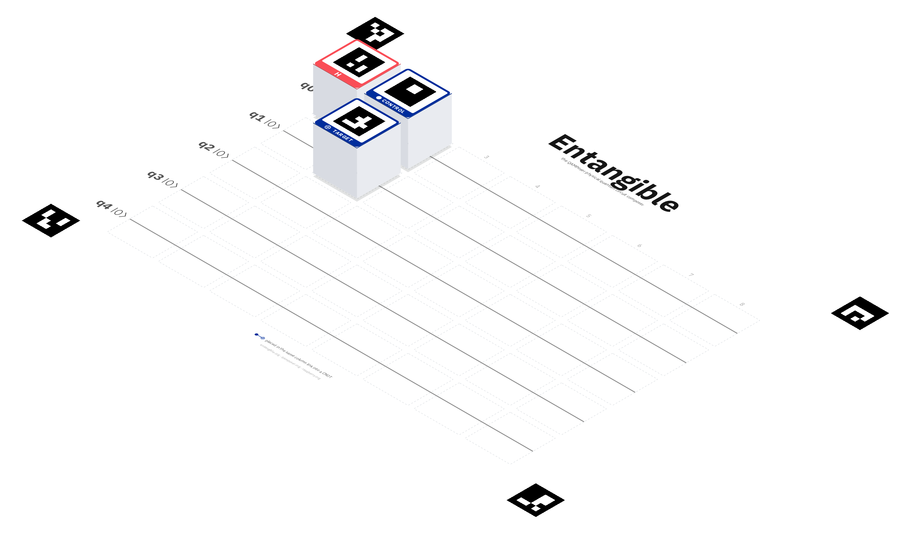

# Entangible

**Entangible** — the QAMPoser physical quantum circuit composer. Visitors at
events, fairs, and booths build real quantum circuits on a table from printed
gate tiles laid out on a printed board mat; a camera recognizes the layout
(ArUco fiducial markers → OpenCV) and a big screen shows the live circuit and
its simulation results via the existing [`@qamposer/react`](https://github.com/QAMP-62)
editor (controlled mode, in-browser `localAdapter`, OpenQASM 2 export). An
optional in-browser noise model pairs realistic results beside the ideal ones
with zero infrastructure — presets are calibration snapshots of four IBM chip
generations (Falcon → Eagle → Heron → Nighthawk), so the "why quantum is hard"
contrast works offline. Hosts: Raspberry Pi 4/5 and macOS; cameras: USB / Pi
Camera / Continuity Camera / iPhone browser streaming.

**Quantina** — the built-in successor to
[Qoffee-Maker](https://github.com/JanLahmann/Qoffee-Maker) and quantum-mixer:
a menu mode where the circuit's measurement probabilities drive a drinks menu
(five built-in packs, host-side custom packs, and an optional dispatch layer
that can drive a Home Connect coffee machine). Try
[entangible.org/?menu=cocktails](https://entangible.org/?menu=cocktails).

**One app, every role** ("Entangible One"): the same React app is the
standalone composer at [entangible.org](https://entangible.org) (on-device
camera + TS detection, no install), the booth big screen (`/?kiosk`), the
visitor's read-only follow-along view (scan the booth QR), the staff phone
camera (operator QR), and the staff `/debug` panel.



*The 3D-printed gate cubes on the printed board mat — H + CNOT = a Bell pair.
Renders are generated from the same source of truth as the print kit and the
vision detector (`tools/render_cube_art.py`).*

## Features

- **Quantum Golf** — 18 holes in four rounds, each unlocking clubs and a concept
  (Easy `X·H·CX` → Medium `+Y` → Difficult `+Z·S` → Extra `+T·CH`). Strokes count
  every gate added *and* removed on the hole; par is the minimum + 2, so minimum
  play scores an eagle. Per-hole bests persist on the device.
- **Random courses with shareable codes** — "New random 18" generates targets
  from each round's own clubs, with difficulty floors and a club-necessity rule
  so a medium hole genuinely needs `Y` and an extra hole genuinely needs `T`/`CH`.
  A course is its 32-bit seed, shown in base 36 (`Course #1z9k4h`, `?course=…`),
  so the same code deals the identical eighteen holes on any device.
- **Computed-optimal solutions** — a hole's worked answer can be revealed after
  the hole-in, or mid-hole when a player is stuck. A background breadth-first
  search over the hole's clubs then either draws a shorter circuit or certifies
  the stored one as minimal ("Solution — optimal").
- **Roll-the-ball state evolution** — the golf Q-sphere/Bloch view steps through
  the circuit one column at a time, with probability mass travelling across the
  sphere surface (splitting when a gate creates superposition), a per-column
  scrubber, and a `prefers-reduced-motion` fallback.
- **Bra-ket display** — the live state typeset under the sphere as
  `1/√2|00⟩ + 1/√2|11⟩` (exact fractions, phases relative to the reference
  amplitude, same convention the sphere colours by), with the target on a second
  line and unmatched target terms highlighted.
- **Tap-to-place touch input** — build on screen with no printer and no camera:
  tap a palette gate to arm it, tap a wire to place it; controlled gates collect
  their control(s) and then the target. Drag-and-drop is unchanged.
- **Gate names on cube side faces** — a 60 mm cube is mostly seen from the side,
  so all four vertical faces carry the gate name as a flush 1 mm inlay in the
  same accent as the top face (one filament slot, not a new one); flip cubes
  split each side face between their two gates, mono kits use paint wells.
- **Wipe-tower-friendly plates + provenance stamps** — MMU print jobs anchor
  their grid in the front-left bed corner and cap at 8 pieces by default, so all
  free bed area consolidates into one region for the wipe tower. Every generated
  plate `.md` and `.3mf` names the commit and date it was built from.

## Downloads

Every printable/cuttable deliverable is built by CI ([`artifacts.yml`](.github/workflows/artifacts.yml))
and published as release assets, so these URLs always serve the current kit:

- [`entangible-3d-tiles.zip`](https://github.com/JanLahmann/entangible/releases/latest/download/entangible-3d-tiles.zip)
  — colored 3MFs, mono STLs (paint-well + filament-swap forms), bed-ready MMU
  and mono plates, and the four UL/UR/LL/LR board-corner blocks, for all four
  variants (tile, cube, and their double-faced siblings).
- [`entangible-laser-kit.zip`](https://github.com/JanLahmann/entangible/releases/latest/download/entangible-laser-kit.zip)
  — red-cut / black-engrave SVGs for wood tiles (corner blocks included).
- [`entangible-print-kit-A4.pdf`](https://github.com/JanLahmann/entangible/releases/latest/download/entangible-print-kit-A4.pdf)
  — the one-file paper kit: gate tiles + board mat.

## Quick start

```sh
make demo    # build the app + serve a no-camera replay loop,
             # then open http://localhost:8443/?kiosk&connect=1
```

## Repo layout

A uv workspace (three Python packages) plus one npm app. See
[`docs/design.md`](docs/design.md) for the full approved design and milestones,
and [`docs/marker-ids.md`](docs/marker-ids.md) for the marker/gate ID scheme.

```
pyproject.toml            # uv workspace root
packages/
  qamposer-vision/        # OpenCV/ArUco pipeline; markers.py = single source of truth
  qamposer-assets/        # printable tile/board PDF generator (SVG -> PDF)
  qamposer-physical-host/ # FastAPI kiosk host (M2); serves the app at /, /?kiosk, /debug
pocket-app/               # Vite + React + @qamposer/react — the ONE app (Entangible One)
shared/                   # neutral @quantum engine + @shared display/ws/capture logic
docs/                     # design, protocol, marker-ids, printing, pocket, booth-ux
tests/                    # fixtures + unit suites
```

## Development

```sh
uv sync                                  # create .venv, install all workspace members
uv run pytest packages/qamposer-vision   # run the vision test suite
```

## Test without a printer

`examples/test-boards/` contains ready-made board images (empty → Bell → GHZ →
warning cases): open one fullscreen on a monitor and point a camera at it —
the [pocket app](https://entangible.org), a phone in the booth camera role, or
`uv run qamposer-vision detect --image …`. See the folder README.

## Qiskit integration

- Every detected circuit is exported as **OpenQASM 2**, ready for
  [Qiskit](https://github.com/Qiskit/qiskit)'s `QuantumCircuit.from_qasm_str`
  — the table is a physical front-end for the Qiskit toolchain.
- **Transfer to IBM Composer**: one tap hands the live circuit to the IBM
  Quantum Composer, as a live-synced browser tab or a QR code visitors scan.
- The in-browser **noise presets** are calibration snapshots derived from
  Qiskit fake backends across four IBM chip generations
  (Falcon → Eagle → Heron → Nighthawk), replayed by a density-matrix simulator.
- The optional [`qamposer-backend`](https://github.com/QAMP-62) (FastAPI +
  Qiskit 2.x + Aer) plugs in via `@qamposer/react`'s `qiskitAdapter` for
  noisy-simulator or real-hardware runs.

## Part of the Fun with Quantum family

Entangible is part of [**Fun with Quantum**](https://fun-with-quantum.org), a
family of open-source quantum outreach projects:
[RasQberry Two](https://rasqberry.org) ·
[RasQberry One](https://rasqberry.one) ·
[Quantego](https://quantego.org) ·
[Qutie](https://qutie.org) ·
[Qoffee-Maker](https://qoffee-maker.org).

## Trademarks

Entangible is an independent community project inspired by the
[IBM Quantum Composer](https://quantum.cloud.ibm.com/composer). It is not
affiliated with, endorsed by, or sponsored by IBM. IBM, IBM Quantum and Qiskit
are trademarks of International Business Machines Corporation.
