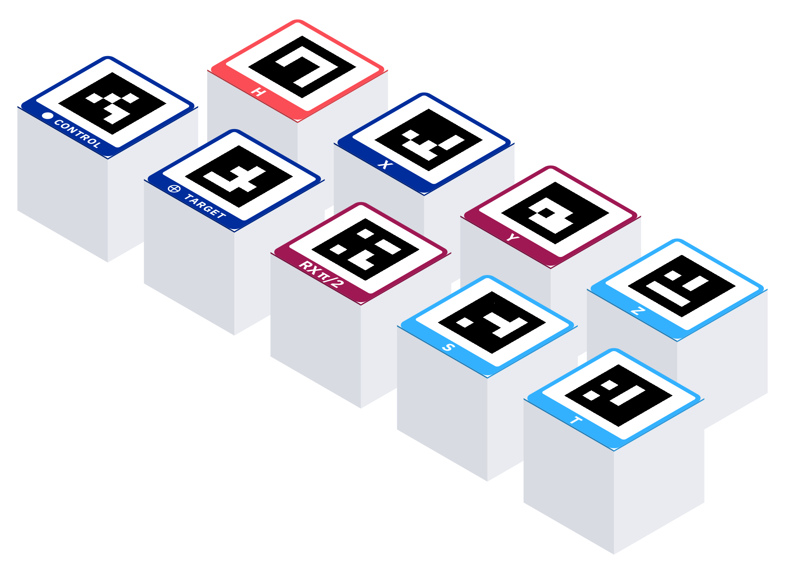

# qamposer-hardware — 3D-printable Entangible gate tiles

Multi-colour 3D gate tiles for the Entangible physical quantum-circuit composer,
generated parametrically from `assets.toml` and the shared `MARKER_TABLE`, so the
printed marker, colours and face layout can never drift from the printed-paper
kit or the vision detector.

Built with [build123d](https://github.com/gumyr/build123d) (OpenCASCADE). Output
is one **MMU colour part per filament** plus a bundled coloured **3MF**, aimed at
a **Prusa Core One with the MMU** (per-layer multi-colour).



## What it makes

For every gate tile in `MARKER_TABLE` (IDs 10-15, 20-31, 40, 41 — H, X, Y, Z,
CNOT control/target, RX/RY/RZ × {π/4, π/2, π, −π/2}, S, T; board corners 0-3 are
*not* tiles):

- Footprint **60 × 60 mm**, corner radius 4 mm (from `assets.toml`).
- Two height variants: **`tile`** (H = 6 mm) and **`cube`** (H = 60 mm).
- A **colour top face** — the last 0.8 mm of height — split into regions that
  match the 2D tile face exactly:
  - **white** field,
  - **black** ArUco marker (the 6 × 6 module grid straight from
    `qamposer_assets.marker_bit_matrix`),
  - the **gate-colour** frame (2.5 mm) + label band (9 mm), with the band's
    caption standing white inside it.
- White body below the face. The **cube** variant is hollowed (3 mm walls, no
  top/bottom perforation) to save filament; the **tile** variant is solid.
- A 0.4 mm bottom chamfer (elephant-foot relief).
- Optional magnet pockets (`--magnets`).

## Generate

```bash
uv run qamposer-hardware generate --variant all --gates all
# a few tiles, tile variant only:
uv run qamposer-hardware generate --variant tile --gates H,S,CNOT
# with magnet pockets:
uv run qamposer-hardware generate --variant cube --gates H --magnets
```

Options: `--variant tile|cube|all`, `--gates H,X,RX,CNOT,...|<marker-id>,...|all`,
`--magnets`, `--out DIR` (default `out/hardware`, git-ignored).

Output per variant lands in `out/hardware/<variant>/`:

- `<gate>-body-white.stl`, `<gate>-marker-black.stl`, `<gate>-accent-<colour>.stl`
  — the three colour parts in one shared coordinate frame.
- `<gate>.3mf` — the same parts bundled with their gate colours baked in.
- `plates.md` — the MMU plate groupings (see below).

The band caption reads white on the gate colour because the glyphs are cut out of
the accent part and left standing in the white body; there is **no** separate
glyph part.

## Printing on a Prusa Core One + MMU

- **Material:** matte PLA (matte kills glare, which is what the ArUco detector
  needs). Any brand; the marker just needs pure **black on white**.
- **Layer height:** 0.2 mm. The colour face is 0.8 mm = 4 layers, so colour
  changes land on clean layer boundaries.
- **Orientation:** print **face UP**. The coloured top face is the camera-facing
  face; printing it up gives the crispest marker and lets you iron it.
- **Ironing:** enable **ironing on the top surface only**. A smooth, matte top
  face markedly improves marker contrast and detection.
- **Seam:** set the seam to **Rear** (or paint it onto a body side) so it never
  lands on the marker face.
- **First layer:** the 0.4 mm bottom chamfer already relieves elephant-foot;
  keep a slightly reduced first-layer extrusion / correct Z-offset. Brim only if
  a cube tips.
- **Import into PrusaSlicer:** either open `<gate>.3mf` directly (colours come
  in), **or** select the three `*.stl` parts, right-click →
  *Import as single object / parts*, and assign each part to its slot per
  `plates.md`.

### Filament slots / plates

`plates.md` (regenerated on every run) lists the MMU plate groupings. The MMU has
5 slots; every plate uses slot 1 = **white** (`#ffffff`) bodies, slot 2 =
**black** (`#000000`) markers, leaving 3 slots for gate accent colours. The gate
set uses **4** accent colours, so tiles split across **2 plates**:

| Filament | Hex | Gates |
| -------- | --- | ----- |
| white | `#ffffff` | all bodies |
| black | `#000000` | all markers |
| red | `#fa4d56` | H |
| blue | `#002d9c` | X, CNOT |
| magenta | `#9f1853` | Y, RX, RY |
| cyan | `#33b1ff` | Z, RZ, S, T |

Hex values are read from `assets.toml` — they are exactly `@qamposer/react`'s
`GATE_COLORS`, so a tile in hand matches its gate on screen.

### Bed-ready print plates

`generate` writes one file **per piece**; `plates` instead writes one 3MF **per
physical print job** — a whole bed of pieces arranged and ready to slice:

```bash
uv run qamposer-hardware plates --faces single --variant tile   # single kit
uv run qamposer-hardware plates --faces double --variant tile   # double kit
uv run qamposer-hardware plates --bed 300x300 --spacing 6       # custom bed/gap
```

Options: `--faces single|double`, `--variant tile|cube`, `--bed WIDTHxHEIGHT`
(default `250x220`, Prusa Core One), `--spacing` mm (default `8`), `--out DIR`.

It reuses the same filament-plate groupings above, then **packs** each plate onto
the bed: 60 × 60 mm footprints on a grid with `--spacing` gaps, row-major and
centred — `250 × 220` fits **3 × 3 = 9** pieces. A plate with more pieces than one
bed holds is split into numbered batches: `plate1-batch1.3mf`, `plate1-batch2.3mf`,
… Each batch 3MF holds **all** its pieces as separate colour objects at their bed
positions (colours identical to the per-piece 3MFs, so it opens colour-correct in
PrusaSlicer). `plates.md` gains a **Print jobs** section listing every batch file,
its pieces, and a tiny ASCII bed sketch. Cubes pack the same 3 × 3 but are a tall,
long print.

## Double-faced pieces

A **double-faced** piece carries a gate on *both* sides: face A on top, face B on
the underside. **Flip it over its bottom (band) edge and the gate switches.** This
halves the number of loose tiles a booth has to store and makes inverse pairs a
single physical object.

```bash
uv run qamposer-hardware generate --faces double --variant tile   # the 24-piece kit
uv run qamposer-hardware generate --faces double --variant cube --gates 14,21,40
uv run qamposer-hardware generate --faces double --variant all
```

Double output lands in `out/hardware/<variant>-double/`. The **tile** variant is
**8 mm** tall: 0.8 mm colour (face A) + 6.4 mm white core + 0.8 mm colour
(face B). The **cube** stays 60 mm (top + bottom faces, hollow core). Piece
filenames pair both gates, e.g. `cnot-ctrl+cnot-tgt-body-white.stl`,
`rx-p2+rx-m2.3mf`, `h+x-accent-red.stl`.

### The kit (24 pieces)

| Piece | Faces | Flip meaning | Qty |
| ----- | ----- | ------------ | --- |
| `cnot-ctrl+cnot-tgt` | CNOT ● \| CNOT ⊕ | control ↔ target | 4 |
| `rx-p2+rx-m2` / `ry…` / `rz…` | R·(+π/2) \| R·(−π/2) | **flip = inverse** | 1 each |
| `rx-p4+rx-p1` / `ry…` / `rz…` | R·(π/4) \| R·(π) | quarter ↔ half turn | 1 each |
| `s+t` | S \| T | S ↔ T | 2 |
| `h+x`, `h+y`, `h+z`, `x+y`, `x+z`, `y+z` | mixed single-qubit | swap the two gates | 2 each |

The single-qubit pieces mix **every** H/X/Y/Z pair twice, so each of H, X, Y, Z is
available on exactly **6 faces**. The ±π/2 rotation pieces are genuine inverses:
flipping `rx-p2+rx-m2` gives you RX(−π/2) = RX(π/2)⁻¹.

### How the mirror works

The underside is the same 0.8 mm colour-region construction as the top, but the
whole face (marker, band, caption) is **mirrored about the X axis** (reflected
`y → size − y`) before it is placed on the bottom layer. That mirror is exactly
undone by the physical flip: when you roll the piece 180° over its bottom band
edge, the underside comes up **unmirrored**, band at the bottom, and its ArUco
marker decodes to face B's canonical ID. (Reflecting the caption too means the
text also reads correctly after the flip — the two mirrors cancel.) This is the
suite's critical test: it simulates the roll-over-the-edge flip and asserts an
overhead camera reads face B's canonical bit matrix cell-for-cell.

Because the underside is now a functional marker face, double-faced pieces get
**no elephant-foot chamfer** on that edge, and `--magnets` is not offered for
them (a pocket would destroy the bottom marker).

### Two accents per piece (cross-family)

Same-family pieces (CNOT ●\|⊕, the rotation pairs, S\|T) print in **one** accent
colour, so they have the usual three parts (body / marker / accent). The
**mixed** H/X/Y/Z pieces span two gate colours — e.g. `h+x` is red (H, top) +
dark blue (X, bottom) — so they carry **two** accent parts,
`…-accent-red.stl` **and** `…-accent-darkblue.stl`, and their `.3mf` has four
coloured parts. The two blues are named **darkblue** (`#002d9c`) and
**lightblue** (`#33b1ff`) in double-piece filenames so a piece that carries both
is unambiguous.

### Plates (double kit)

`plates.md` in the double output uses a relaxed rule: a plate hosts any pieces
whose **combined** accent families number ≤ 3 (white + black + 3 MMU slots). The
mixed pieces cover all six cross-family colour pairs, which cannot fit on two
3-family plates, so the double kit needs **3 plates**:

| Plate | Accent slots | Pieces |
| ----- | ------------ | ------ |
| 1 | dark blue, magenta, light blue | CNOT, all RX/RY/RZ pairs, S\|T, X\|Y, X\|Z, Y\|Z |
| 2 | red, dark blue, magenta | H\|X, H\|Y |
| 3 | red, light blue | H\|Z |

For a cross-family piece, load both its accent filaments on the same plate and
assign each `…-accent-<colour>` part (or open the `.3mf`) to the matching slot.

### Print orientation (double-faced)

Both faces are marker-critical, but only the **up-facing** one can be ironed, so
one face is always slightly crisper. On the textured PEI sheet a double tile
prints fine with **either** face down (MMU lays multi-region colour on the first
layer cleanly). Recommended: print with the **marker face you care most about UP**
and **ironing on the top surface only**; or print on a **smooth sheet** so the
bottom face comes out glossy-flat too. Keep the seam to **Rear** and a correct
first-layer Z-offset. If detection of the down-face is marginal, reprint that
piece with the other face up.

## Rotation-angle tactile notches

Rotation tiles (RX/RY/RZ) carry the full angle in the band caption (`RX π/2`,
`RY -π/2`, …). As a **tactile** backup so angle variants are also distinguishable
by hand, the bottom band edge carries small notches encoding the angle:

| Angle | Notches |
| ----- | ------- |
| π/4 | 1 |
| π/2 | 2 |
| π | 3 |
| −π/2 | 4 |

The count is the angle's index in `qamposer_vision.markers.ROTATION_ANGLES`.
Non-rotation tiles have no notches. The notches are shallow slots in the band
edge and do not affect the 60 × 60 footprint bounding box.

On a **double-faced** rotation piece both faces carry notches, so they are split
to opposite halves to stay legible by touch: **face A's** notches sit on the
**left half** of its (bottom) band edge, **face B's** on the **right half** of
its (top, opposite) band edge. So `rx-p2+rx-m2` has 2 notches bottom-left
(RX π/2) and 4 notches top-right (RX −π/2) — feel the left edge for the face-up
angle, the right edge for the flip side.

## Cube parallax caveat

The `cube` variant puts the marker face **60 mm above the board plane**. The
board homography is solved on the mat's corner markers, which lie *on* the board.
A camera that is not looking straight down therefore sees a cube's top face
shifted **laterally** relative to where a flat tile would sit (parallax grows
with height and viewing angle). At steep camera angles this lateral shift can
push a cube's detected centre outside the grid tolerance and the tile may be
**rejected as off-grid**. Cubes want a **near-vertical camera**; if you use them,
mount the camera high and centred, or prefer the flat `tile` variant for
oblique-camera booths.

## Magnets

`--magnets` adds two Ø6.2 mm × 2.1 mm pockets to the underside (for 6 mm × 2 mm
disc magnets). Press-fit or glue a magnet into each pocket **after** printing;
mind polarity if you want tiles to stack or snap to a steel board consistently.
Default is **off**.

## Validate: print one H tile first

Before printing a whole kit, print a single **H** tile and confirm the detector
reads it:

```bash
uv run qamposer-hardware generate --variant tile --gates H
# print out/hardware/tile/h-*.stl (or h.3mf), then photograph it on the mat and:
uv run qamposer-vision detect --image path/to/photo.jpg --json
```

You should see marker ID 10 (H) detected at the cell you placed it on. If not,
check: matte surface (no glare), pure black/white marker, top face ironed, and
the camera roughly overhead. Once one H tile detects cleanly, print the rest.
